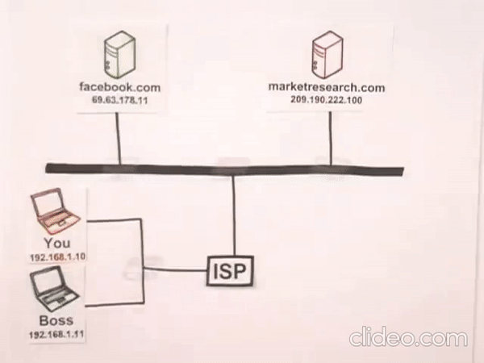

# Internet, c'est quoi ?

#### Introduction

La plupart des gens pensent qu'Internet est un cloud sur lequel tout le monde se connecte, c'est faut : internet n'est pas un cloud. Car un cloud a justement besoin d'Internet pour exister. La réalité est toute autre.

Internet est un réseau filaire (_fibre optique_), satellitaire (_antenne parabolique_) ou sans fil (_GSM - Tablette - Objet connecté_) plein de câble qui parcourt le monde sur terre et dans le fond des mer pour connecter entre eux tous les continents, tous les pays, et tous les gens à travers le monde. Un simple câble qui connecte tout le monde.

### Principe de fonctionnement d'Internet

Pour pouvoir communiquer, deux personnes ou plus à travers le monde doivent être équipé de ses 3 prérequis :

1. Un appareil
    - Un GSM
    - Une Tablette
    - Un Ordinateur
    - Un objet connecté avec ou sans fil
2. Un OS
    - Android
    - Windows
    - Linux
    - Ubuntu
    - Mac
3. Un fournisseur d'accès au réseau
    - Proximus
    - Orange
    - Telenet
    - VOO

Une fois que vous avez ses trois prérequis, il vous sera possible chacun de votre côté de vous connecter aux files d'Internet pour pouvoir connecter vos deux appareils.

## Identifier les appareils connectés au réseaux

Pour pouvoir s'y retrouver, chaque appareil ou objet connecté au réseau Internet doit posséder sa propre adresse IP. Les deux lettres I.P signifient : Internet Protocol.

##### C'est quoi un internet protocole ?

C'est un numéro unique attribué de manière provisoire ou durable à un ordinateur connecté à un réseau informatique qui utilise l'internet protocole.

Le problème, c'est que pour retenir le numéro attribué et qui est composer généralement de 10 chiffres, c'est assez compliquer. Le site web de Google par exemple, pour se connecter au réseau, utiliser un serveur qui a sa propre adresse IP. Jusqu'ici, pour vous rendre sur le site web de Google, vous deviez taper dans la barre de recherche [google.com](https://google.com). En réalité la vrai adresse de google.com c'est : 142.250.184.238

Ceci est un bout de code informatique pour affiquer le nom de dommaine  
`<a href="https://google.com>Google.com</a>`

Allez, y faites le teste : copier et coller cette adresse IP dans la barre de recherche et vous atterrirez sur le site de google.com

Donc pour des raison plus pratique, les adresse IP des site web ont toute êtes associé a un nom de domaine, plus pratique à retenir.

> Aucun code n’a zéro défaut.  
> Mark Zuckerberg

##### C'est quoi un nom de domaine ?

Comme indiqué plus haut, un nom de domaine et un ensemble de lettre et de chiffre qui a pour but de remplacer une adresse IP d'un site web. Le nom de domaine, c'est tout ce qui se trouve dans la barre de recherche après le https://

Maintenant, qu'on a planté le décor et qu'on a vue comment se connecter à Internet, passons au fonctionnement d'Internet.

## Comment ça fonctionne internet ?

Pour mieux comprendre, nous allons prendre un exemple simple : l'envoi d'un e-mail entre deux personnes connecté à Internet. L'une est chez le fournisseur AOL et l'autre chez le fournisseur GMAIL.

### Envoyer un e-mail

#### Le client

Le client, c'est vous, votre appareil n'étant pas directement relié à Internet, vous êtes donc le client du (ISP) en anglais Internet Service Provider, en français votre fournisseur d'accès à Internet. C'est lui qui possede les serveurs sur lequel vous vous connecer a internet grace a votre connexion filaire appeler fibre optique (encienement DSL puis ADSL).

### Le Fournisseur d'accès à Internet

Dans notre exemple, ma boite émail est chez Google Gmail, avant de parler de l'envoi d'e-mails, voyons comment afficher une simple page internet sur mon ordinateur. Visitons le site web d'aol.com pour cet exemple.

Je peux donc me connecter à leur page internet depuis mon ordinateur. La connexion passe par la fibre optique, puis transite par mon fournisseur d'accès à Internet, puis entre sur le réseau internet, puis grâce au nom de domaine que j'ai renseigné sur mon navigateur, j'envoie une requête aux serveurs d'ALO pour lui demander d'afficher le site internet sur mon ordinateur.

Voyons maintenant comment fonctionne l'envoi d'un e-mail.

### Les e-mails

#### Rédiger un e-mail

Dans cet exemple, avant de pouvoir envoyer mon e-mail, je dois d'abord me connecter au site internet de Google Gmail pour pouvoir rédiger mon e-mail. Depuis mon ordinateur, c'est la procédure que précédemment, sauf qu'au lieu de demander au serveur d'ALO d'afficher la page, c'est au serveur de Google à qui on demande d'afficher la page de connexion a la boite e-mail Gmail. Une fois connecter, il est temps de rédiger l'e-mail à envoyer.

#### Envoyer un e-mail

Votre e-mail est prêt ? Parfait, il est temps de l'envoyer a votre contact. Pour ce faire, votre e-mail, qui est stocké sur le serveur de Google Gmail, transite par le réseau internet jusqu'au serveur d'ALO sur lequel votre contact a enregistré son e-mail. Une fois arriver chez ALO, ce sont eux qui prennent le relais pour l'acheminer depuis leurs serveurs vers l'ordinateur de votre contact via leurs réseaux de câbles internet.

## Les paquets de données

Un e-mail, une photo, une vidéo, un fichier text ou toute autres donnée numérique que vous souhaiter envoyer a quelque, ne transite pas en une seule fois. Ils sont acheminés d'un point A à un point B grâce à ce qu'on appelle des paquets.

#### C'est quoi un paquet ?

Pour une meilleure explication, on va prendre l'exemple d'une image. Vous souhaitez envoyer l'image de votre bébé à votre amie en utilisant un e-mail. Au moment où vous allez télécharger l'image dans l'e-mail, il reste en un seul morceau. Mais à l'instant ou vous appuyer sur "envoyer". Le réseau informatique va découper cette image en de nombreux petits morceaux, ce sont ses morceaux qu'on appelle des paquets. Donc, pour reprendre l'exemple de Gmail et d'ALO, l'expéditeur Gmail va découper l'image en petit paquet pou les envoyer sur le réseau, puis de l'autre côté, ALO va réceptionner ses paquets les uns après les autres, puis ALO va reconstituer l'image pour qu'elle soit comme à l'origine avant de l'expédier a votre amie.

#### Comment ça marche techniquement ?

Pour ce nouvel exemple, imaginons que vous êtes deux personnes, connecter sur le même réseau informatique. Vous et votre patron, vous êtes tous les deux au bureau, vous êtes connecté à Facebook et lui, votre patron, a un site marchand. La question, c'est, comme être sûr que les paquets qui transite entre votre ordinateur et Facebook, arrive bien à destination et ne finissent pas par erreur sur l'écran de votre patron ?

Pour éviter cela, comme on l'a expliquer plus haut, tout ce qui est connecter à Internet, que ce soit des appareil, ou site internet, tout le monde a une adresse IP, c'est donc grâce à ses adresse IP qu'on s'assure que tout se déroule correctement. Il y a malgré tout autre chose qui nous le garanti : le routeur.

#### C'est quoi un routeur ?

Un Routeur est un appareil qui est placé à chaque nœud du réseau. Vous et votre patron, vous êtes sur le même réseau, mais votre fournisseur d'accès a Internet à des milliers d'autre client, il y a donc un routeur entre vous et lui. Entre le réseau internet et votre fournisseur d'accès, aussi, il y a un routeur.
Dit autrement, à chaque fois qu'un croisement entre deux chemins de câbles) À lieu sur la route (réseau), il y a un agent de circulation (routeur) qui vérifie que les voitures (paquet) arrivent à la bonne destination (Adresse IP).

#### Envoyer un paquet

Pour envoyer un paquet, il faut s'imaginer que chacun d'eu a une adresse de destination, comme sur un GPS, pour se rendre d'un point A à un point B, le GPS vous demande de tourner à droite, gauche, tout droit, etc. Ici, c'est la même chose, la seule différence, c'est que chaque instruction du GSP et une adresse IP.

Dans cet exemple pour envoyer un paquet de votre ordinateur à Facebook : l'adresse de destination ressemblerait grossièrement a :
Étape 1 : sortir de l'ordinateur du client avec l'adresse IP 182.168.1.10
Étape 2 : tournez à droite jusqu'au routeur avec l'adresse IP 192.168.2.1
Étape 3 : allez tout droit jusqu'au routeur avec l'adresse IP 192.168.1.1.1
Étape 4 : tourner à gauche sur 500 mètres jusqu'au routeur avec l'adresse IP 192.168.0.2
Étape 5 : prenez l'autoroute sur 7 km jusqu'à la sortie Routeur avec l'Adresse IP 192.168.3.1.0
Étape 6 : dans 300 m, vous êtes arrivé à destination sur le routeur avec l'adresse IP 192.168.5.1

Comme vous l'avez sans doute compris, Facebook a bien reçu votre requête (paquets) il va vous adresser une réponse en vous faisant parvenir cette réponse également sous forme de paquet. C'est exactement la même chose pour le retour des paquets depuis Facebook vers votre ordinateur.

## Conclusion

Vous faites désormais partie du club très fermé dans ce monde qui comprend réellement comment Internet fonctionne, bravo !!
Actuellement, seulement 10 % de la population mondiale comprend ce fonctionnement. Vous pouvez donc être fière de vous. Vous avez un nouveau sujet de conversation pour briller en société.

Merci d'avoir regarder cette presentation.
